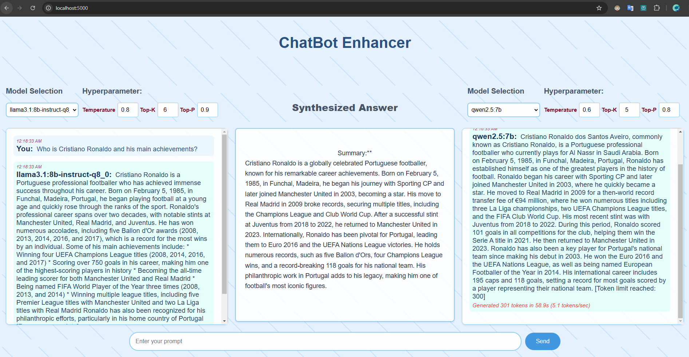

# Chatbot Enhancer

This is a web application that allows you to compare responses from 2 different local LLMs side by side, and then use reasoning model Deepseek-R1-8B to summarize their common points to a synthesized answer. With this method, it can allelivate the effect of signle model's hullicinaiton and give you a more accurate answer to your prompt.

- Token per second (TPS) rate and token count are displayed after each output for both models to show model performance.

- Configurable hyperparameters in the front window, which can be leveraged to control the creativeness of output answers.  

## Features

- **Model Selection**: Choose from available Ollama models from dropdown menus.
- **Dual Model Comparison**: Compare the output of two different LLM models for same prompt side by side.
- **Deepseek-R1 for summary**: Use local Deepseek-R1-8B model to summarize the 2 repsonses and synthesize common ground.
- **Automatic Synthesis**: Automatically identifies and summarizes common points between 2 responses with a third LLM that is specialized in text analysis and summarization. 
- **Output Management**: Use a system prompt to enforce a 300-token limit for consistent, concise responses.
- **Token Generation Speed**: Show token generation rate of each response is calculated and displayed to compare LLM performance.

## Prerequisites

- Python 3.10
- Flask
- Ollama 0.5.0 or above
- Required Python packages (requirements.txt)

## Setup

1. Clone the repository:

    git clone https://github.com/maverick001/chatbot-enhancer.git

    cd chatbot-enhancer

2. Install dependencies:

    pip install -r requirements.txt

3. Download your desired open-source models from Ollama:

   Ollama pull Deepseek-r1:8B
   Ollama pull Llama3.1:8B
   Ollama pull Qwen2.5:7B

4. Make sure Ollama is running locally on port 11434

   Ollama serve

5. Start the Flask server:

    python backend.py

6. Open your browser and navigate to:
http://localhost:5000

## Usage

1. Select your desired models from the dropdown menus on both sides
2. Enter your prompt in the input field at the bottom
3. Click "Send" to generate responses
4. View the responses stream in real-time in the side panels
5. Read the synthesized analysis in the center panel, which includes:
   - Key common points between both responses
   - A synthesized summary of the shared insights

## Technical Details

- Backend: Flask (Python)
- Frontend: HTML, CSS, JavaScript
- LLM Integration: Ollama API, LangChain
- Streaming Support: Server-Sent Events (SSE)
- GPU Acceleration: Inference acceleration enabled with CUDA v12 （verified with RTX 4060）.

## License

MIT License

## Contributing

Contributions are welcome! Please feel free to submit a Pull Request.